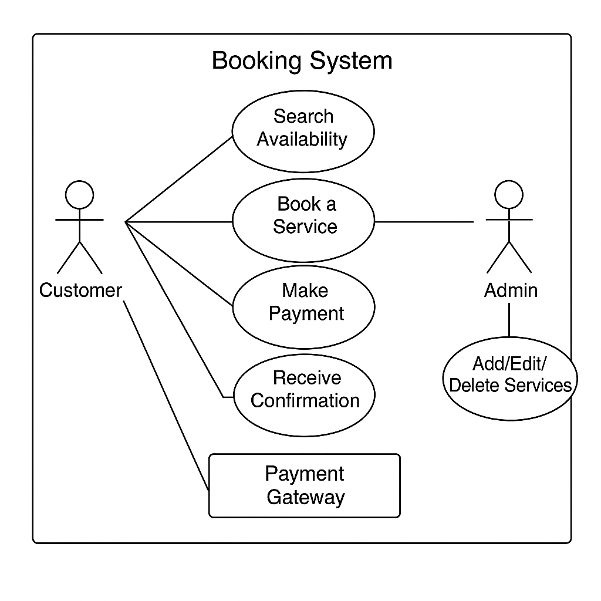

# requirement-analysis
# Requirement Analysis in Software Development

## Intro
This repository is a requirement document for a property online booking service

## What is Requirement Analysis?
Requirement analysis is an overview, definitions, and analyziz of the requirements of a Software Product, which are of two types;
- Non-functional requirements: This has to do with processes and experience of a product such as load time of an app
- Functional requirements: Things we want the product to be able to do such as 

It involves requirement gathering, elicitation, documentation, analysis & modelling, and vallidation.

Some of it importance in SDLC includes: 
- it help avoids disgruntleness among stakeholders
- it ensures clarity of purpose
- it help make infored decissions in system architecture and UI/UX designs

## Why is Requirement Analysis Important?
- Ensures a more accurate cost and time estimation of project cost
- Brings clarity and understanding

## Key Activities in Requirement Analysis
- **Requirement Gathering** involves ressearching for needed requirements
- **Requirement Elicitation**  involves ellaborating and brainstorming.
- **Requirement Documentation** involves putting it into documents with user stories, user journey maps, etc
- **Requirement Analysis and Modeling** analyze, prioritize, and vissualize
- **Requirement Validation** is to get all stakeholders to approve the requirement

## Types of Requirements
- Functional requirement: is all about what the system should do such as user authentication, search functionality, etc 
- Non-functional requirement: its all about how the system should perform such as number of users it could handle er time, load time, scalability, etc. 

## Use Case Diagrams

### What is a Use Case Diagram?
A **Use Case Diagram** is a visual representation used in **requirement analysis** to capture the interactions between **actors** (users or external systems) and the **system** itself. It helps to clarify **what the system should do** from a user's point of view.

### Benefits of Use Case Diagrams
- Simplifies complex system functionality
- Clearly identifies user roles and system boundaries
- Serves as a communication tool between developers and stakeholders
- Assists in writing detailed user stories and test cases
- Helps in validating requirements early in the software development lifecycle

### Booking System - Use Case Diagram

Below is the use case diagram for a basic booking system:

### Actors:
- Customer – books a service
- Admin – manages bookings and services
- Payment Gateway – processes payments

### Use Cases:
- Search for availability
- Book a service
- Cancel a booking
- Make payment
- Receive confirmation
- Manage bookings
- Add/Edit/Delete services

## Acceptance Criteria

### What is Acceptance Criteria?

**Acceptance Criteria** are the specific conditions a product or feature must meet to be accepted by the user, customer, or product owner. It defines what is considered **"done" or "complete"** from a business and functional point of view.

### Importance in Requirement Analysis

- **Clarity**: Eliminates ambiguity between stakeholders, developers, and testers.
- **Alignment**: Ensures the product delivers exactly what the user expects.
- **Testability**: Provides a clear basis for writing test cases.
- **Scope Control**: Helps prevent scope creep by defining limits of a feature.
- **Delivery Confidence**: Ensures team members build the *right thing*, not just *something*.

### Example: Acceptance Criteria for “Checkout Feature” in a Booking Management System

- Feature: **Checkout**

**User Story**:  
As a customer, I want to check out my booking after selecting a service so I can finalize my reservation and receive confirmation.

**Acceptance Criteria:**

1. ✅ The system must display a **summary of booking details** before payment.
2. ✅ User must be able to **enter or confirm payment information**.
3. ✅ Payment must be processed via an **integrated payment gateway** (e.g., Flutterwave or Paystack).
4. ✅ A **success message** must be displayed upon successful payment.
5. ✅ User must receive a **confirmation email or SMS** after checkout.
6. ✅ If payment fails, an **error message** should be shown with retry option.
7. ✅ The system must log **booking and payment data** in the database after checkout.
8. ✅ Checkout should not proceed if **required booking info is missing**.

